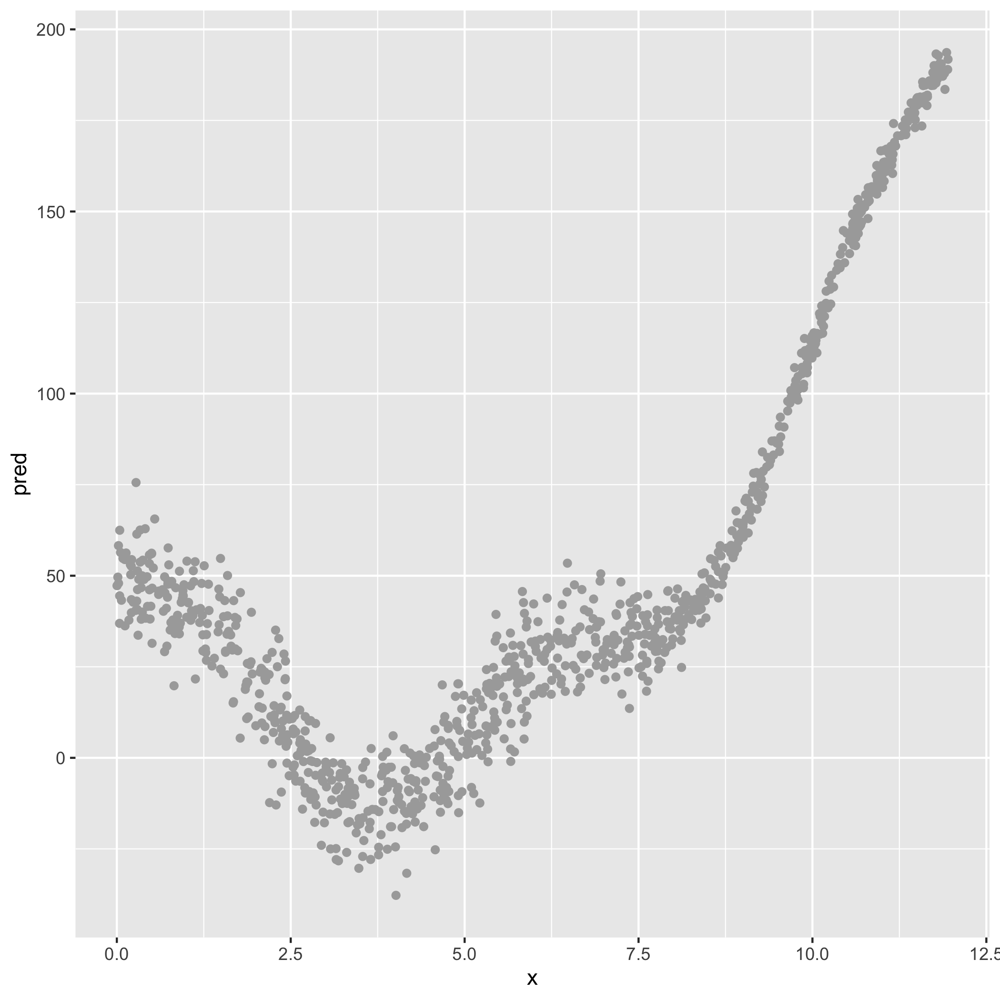
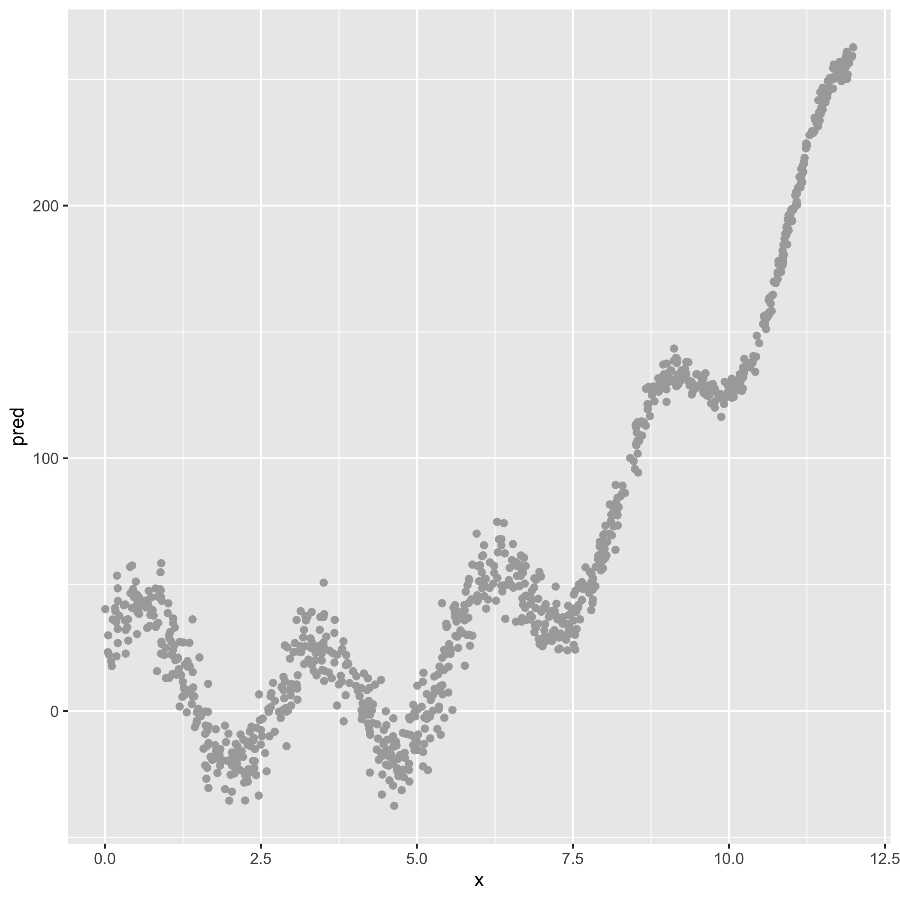
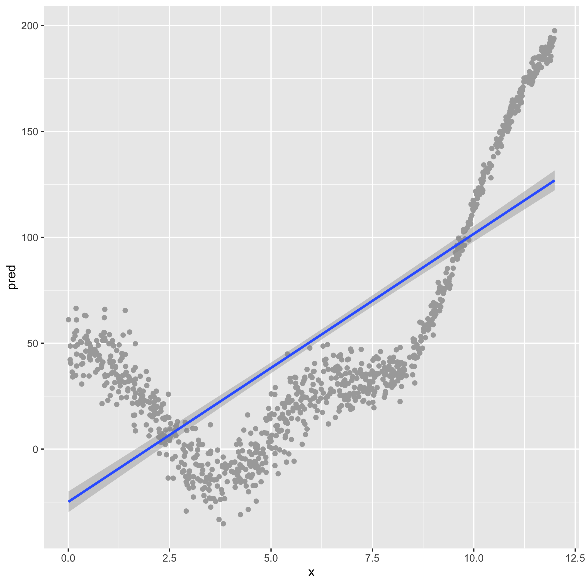
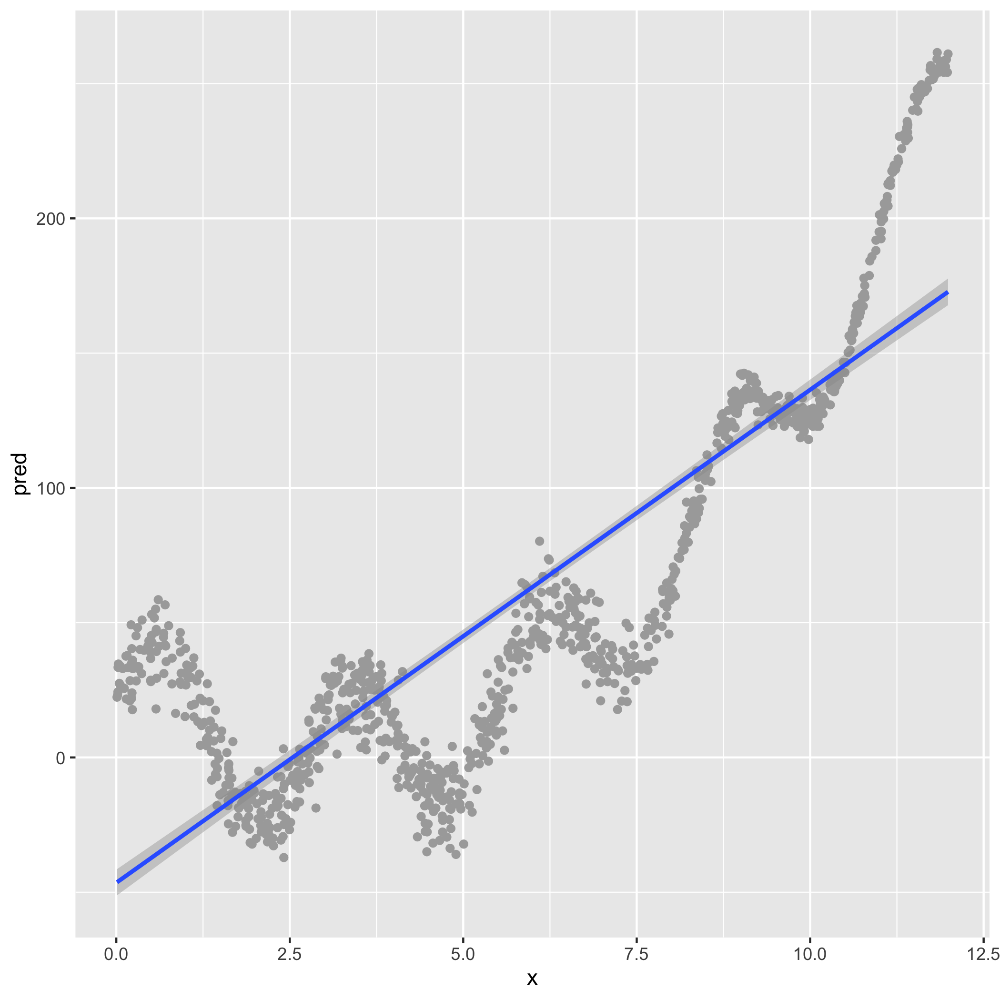
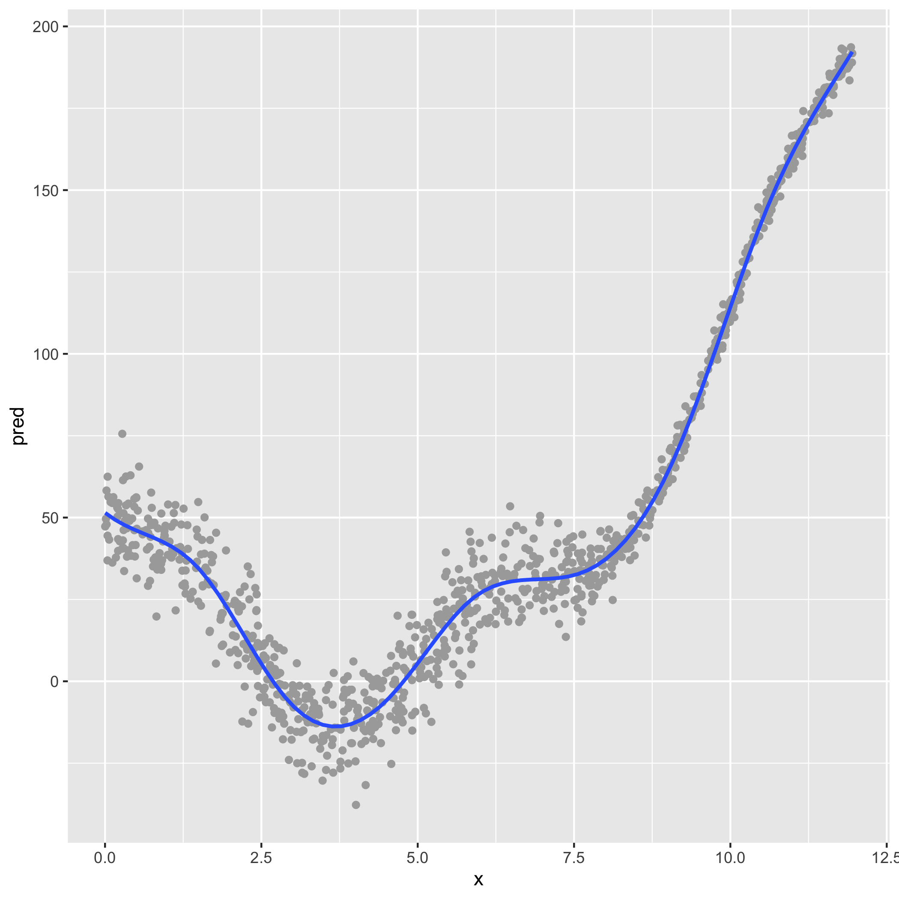
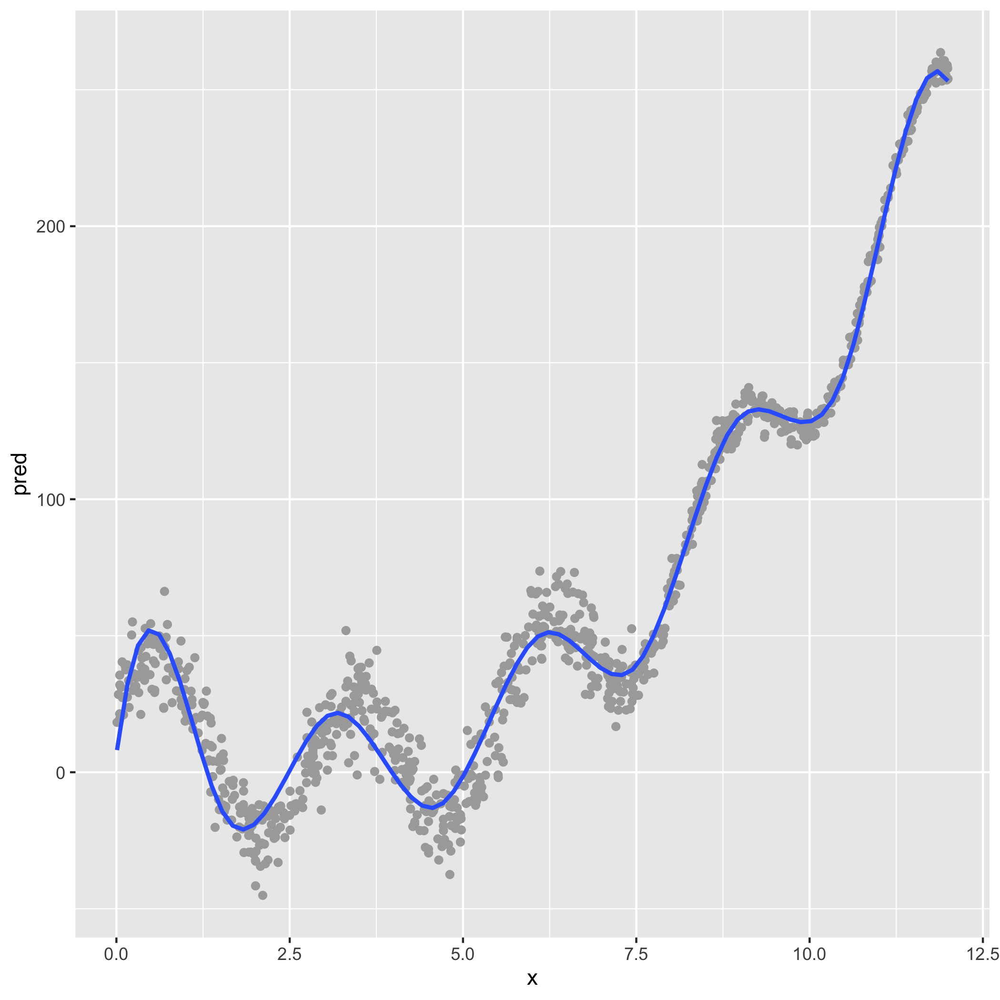

background-image: url(https://imgs.xkcd.com/comics/tasks_2x.png)
background-position: center
background-size: contain

```{r setup, include=FALSE}
options(htmltools.dir.version = FALSE)
```

---

class: inverse, center, middle

# Introductions (Part 1 of 7)

---

# About me

.pull-left[
* Joshua (Josh) Rosenberg, Ph.D.
* Assistant Professor, STEM Education, [University of Tennessee, Knoxville](https://utk.edu/)
* Husband to Katie
* Dad to a toddler
* Research areas:
  * Science education
  * Data science education (a pedagogy)
  * Data science in education (a research approach)
     * Especially Bayesian methods
* Former science teacher in North Carolina
* R user since 2014; developer of many R packages
* Presently PI or Co-PI for three National Science Foundation grants
]

.pull-right[

```{r, echo = FALSE, out.width="100%"}
knitr::include_graphics("img/joro-cycle.jpeg")
```

]
---

# Goals of this workshop

### Over-arching goal:

Get started with applying machine learning methods in relatively short order through the use of R

### Specific aims are to learn about:

- a small but important set of core ideas about machine learning
- how these ideas are instantiated through packages for R, specifically *tidymodels*
- how to conduct a start-to-end machine learning analysis 

### Also: 

This is an opportunity to get to know and learn from one another and to build capacity in science education research to do machine learning
---

# Agenda

1. Introductions (15 min.)
1. Primer on/review of R and the "Getting Ready for the Workshop" task (15 min.)
1. Overview of foundational machine learning ideas (20 min.) - then a **10 min. break**
1. Introduction to machine learning for a _regression_ problem (20 + 20 min. = 40 min.) - then a **15 min. break**
1. Introduction to machine learning for a _classification_ problem (20 + 10 min. = 30 min.) - then a **5 min. break**
1. A very brief discussion of text-based uses of machine learning (15 min.)
1. Conclusion and resources to learn and do more and discussion/Q&A (15 min.)

---

# Break-out rooms!

In randomly assigned break-out rooms of ~5 people, *starting with whomever has a 
birthday nearest to today*:

- **Introduce yourself** and your position and affiliation
- **Describe one thing that you're not good at that you like to do**
- **Describe one thing that you're good at that you don't like to do**
- **Share two words** that capture your attitude toward/beliefs about machine learning 

Be prepared to share your two words with the whole group when we return from break-out rooms. 

---

class: inverse, center, middle

# Primer on R (Part 2 of 7)

---

# What's R?

- R is both **statistical software** that is free, cross-platform, and open-source, and a **programming language**

- It is well-suited to doing data science and machine learning, but it is *not* the only good option
  - Python, in particular, is a good option

- I prefer to use R for a few reasons:
  - It treats data frames (think data stored in a spreadsheet) as a first-class object
  - It is better for the kinds of things that I (and I think many science education researchers) commonly want to do
    - Example: It's non-trivial to find a python module to fit a multi-level/hierarchical linear model; in R, it is an extension of the code to fit a regression model

- RStudio Cloud provides a good environment for teaching and learning R

---

# R Primer

What questions or reactions did you have to the Getting Ready work in RStudio Cloud?

Let's head over to that and work through it.

---

class: inverse, center, middle

# Overview (Part 3 of 7)

---

# Defining Machine Learning (ML)

- *Artificial Intelligence (AI)*
.footnote[
[1]  I feel super uncomfortable bringing AI into this, but perhaps it's useful just to be clear about terminology
]
: Simulating human intelligence through the use of computers
- *Machine learning (ML)*: A subset of AI focused on how computers acquire new information/knowledge

This definition leaves a lot of space for a range of approaches to ML

---

# An example from my work

**Using Twitter users profile descriptions to predict whether or not they were teachers**

- Manually coded > 500 profiles for whether they were teachers or non-teachers
- Trained a Support Vector Machine model (or algorithm) on _text features_ using 90% of the data
- For the remaining 10% of the data, we predicted whether or not someone was a teacher with an accuracy of 85%; $\kappa$ = 0.612.
- Then used the trained classifier to predict whether or not 1000s of users were or were not teachers (and used these classifications in a multi-level model)

Rosenberg et al., *AERA Open*, in press

https://osf.io/xymsd/

---

background-image: url("https://i.vas3k.ru/7vx.jpg")
background-position: center
background-size: contain

---

# A helpful frame: Supervised & unsupervised

## Supervised ML

- Requires coded data or data with a known outcome
- Uses coded/outcome data to train an algorithm
- Uses that algorithm to **predict the codes/outcomes for new data** (data not used during the training)
- Can take the form of a *classification* (predicting a dichotomous or categorical outcome) or a *regression* (predicting a continuous outcome)
- Algorithms include:
  - [Linear regression (really!)](https://web.stanford.edu/~hastie/ElemStatLearn/)
  - Logistic regression
  - Decision tree
  - Support Vector Machine

---

# What kind of coded data?

> Want to detect spam? Get samples of spam messages. Want to forecast stocks? Find the price history. Want to find out user preferences? Parse their activities on Facebook (no, Mark, stop collecting it, enough!) (from [ML for Everyone](https://vas3k.com/blog/machine_learning/))

In science education:

- Assessment data (e.g., [1](https://link.springer.com/article/10.1007/s10956-020-09895-9))
- Data from log files ("trace data") (e.g., [1](https://www.tandfonline.com/doi/full/10.1080/10508406.2013.837391?casa_token=-8Fm2KCFJ30AAAAA%3Altbc8Y8ci_z-uLJx4se9tgvru9mzm3yqCTFi12ndJ5uM6RDl5YJGG6_4KpUgIK5BYa_Ildeh2qogoQ))
- Open-ended written responses (e.g., [1](https://link.springer.com/article/10.1007/s10956-020-09889-7), [2](https://doi.org/10.1007/s11423-020-09761-w))
- Achievement data (i.e., end-of-course grades) (e.g., [1](https://link.springer.com/article/10.1007/s10956-020-09888-8), [2](https://search.proquest.com/docview/2343734516?pq-origsite=gscholar&fromopenview=true))

What else?
- Drawings/diagrammatic models
- Data collected for formative purposes (i.e., exit tickets)
- ???

---

# How is this different from regression?

The _aim_ is different, the algorithms are methods of estimation are not (or, are differences in degree, rather than in kind).

In a linear regression, our aim is to estimate parameters, such as $\beta_0$ (intercept) and $\beta_1$ (slope), and to make inferences about them that are not biased by our particular sample.

In an ML approach, we can use the same linear regression model, but with a goal other than making unbiased inferences about the $\beta$ parameters:

<h4><center>In supervised ML, our goal is to minimize the difference between a known $y$ and our predictions, $\hat{y}$</center></h3>

---

# So, how is this really different?

This _predictive goal_ means that we can do things differently:

- Multicollinearity is not an issue because we do not care to make inferences about parameters
- Because interpreting specific parameters is less of an interest, we can use a great deal more predictors
- We focus not on $R^2$ as a metric, but, instead, how accurately a _trained_ model can predict the values in _test_ data
- We can make our models very complex (but may wish to "regularize" coefficients that are small so that their values are near-zero or are zero):
  - Ridge models (can set parameters near to zero)
  - Lasso models (can set parameters to zero)
  - Elastic net models (can balance between ridge and lasso models)

---

# Okay, _really_ complex

- Okay, _really_ complex:
  - Neural networks
  - Deep networks
- And, some models can take a different form than familiar regressions:
  - *k*-nearest neighbors
  - Decision trees (and their extensions of bagged and random forests)
- Last, the modeling process can look different:
  - Ensemble models that combine or improve on ("boosting") the predictions of individual models

---

# A helpful frame: Supervised & unsupervised

## Unsupervised ML

- Does not require coded data; one way to think about unsupervised ML is that its purpose is to discover codes/labels
- Is used to discover groups among observations/cases or to summarize across variables
- Can be used in an _exploratory mode_ (see [Nelson, 2020](https://journals.sagepub.com/doi/full/10.1177/0049124118769114?casa_token=EV5XH31qbyAAAAAA%3AFg09JQ1XHOOzlxYT2SSJ06vZv0jG-s4Qfz8oDIQwh2jrZ-jrHNr7xZYL2FwnZtZiokhPalvV1RL2Bw)) 
- **Warning**: The results of unsupervised ML _cannot_ directly be used to provide codes/outcomes for supervised ML techniques 
- Can work with both continuous and dichotomous or categorical variables
- Algorithms include:
  - Cluster analysis
  - [Principle Components Analysis (really!)](https://web.stanford.edu/~hastie/ElemStatLearn/)
  - Latent Dirichlet Allocation (topic modeling)

---

# What technique should I choose?

Do you have coded data or data with a known outcome -- let's say about science students -- and, do you want to:

- _Predict_ how other students with similar data (but without a known outcome) perform?
- _Scale_ coding that you have done for a sample of data to a larger sample?
- _Provide timely or instantaneous feedback_, like in many learning analytics systems?

<h4><center>Supervised methods may be your best bet</center></h4>

Do you not yet have codes/outcomes -- and do you want to?

- _Achieve a starting point_ for qualitative coding, perhaps in a ["computational grounded theory"](https://journals.sagepub.com/doi/full/10.1177/0049124117729703) mode?
- _Discover groups or patterns in your data_ that may be of interest?
- _Reduce the number of variables in your dataset_ to a smaller, but perhaps nearly as explanatory/predictive - set of variables?

<h4><center>Unsupervised methods may be helpful</center></h4>

---

# But, how do I select a particular model?

One general principle is to **start with the simplest useful model** and to _build toward
more complex models as helpfuL_.

This principle applies in multiple ways:

- To choose an algorithm, start with simpler models that you can efficiently use and understand
- To carry out feature engineering, understand your predictors well by starting with a subset
- To tune an algorithm, start with a relatively simple set of tuning parameters

This isn't just for beginners or science education researchers; [most spam filters use Support Vector Machines (and used Naive Bayes until recently)](https://vas3k.com/blog/machine_learning/) due to their combination of effectiveness and efficiency "in production."

---

# What's stopping me from specifying a complex model?

- Nothing too much, apart from computing power, time, and concerns of 
- A "check" on your work is your predictions on _test_ set data
  - *Train data*: Coded/outcome data that you use to train ("estimate") your model
  - *Validation data<sup>1</sup>*: Data you use to select a particular algorithm
  - *Test ("hold-out") data*: Data that you do not use in any way to train your data

- An important way to achieve good performance with test data is to balance between the inherent _bias_ in your algorithm and the _variance_ in the predictions of your algorithm; this is referred to as the **bias-variance** trade-off of _all_ models

.footnote[
[1] not always/often used, for reasons we'll discuss later

]

---

# Illustrating the bias-variance tradeoff

```{r, echo = FALSE, fig.align="center", message = FALSE}
library(ggplot2)

set.seed(5)
dat = data.frame(x = runif(1000, 0, 12))
dat$x = sort(dat$x)
dat$y = with(dat, sin(x * 1.3) * 15 + 3 * (x - 4)^2)
sigma = with(dat, (exp(x - 5)/(1 + exp(x - 5)) - exp(x - 7)/(1 + exp(x - 7)) * 
    2) + 1.4) * 6
dat$yobs = dat$y + rnorm(nrow(dat), mean = 0, sd = sigma)

ggplot(dat, aes(x = x, y = yobs)) +
  geom_point(color = "darkgray") +
  ylab("pred")

ggsave("img/bias-variance-data-1.png")
```

---

# A strongly biased algorithm (linear model)

```{r, echo = FALSE, fig.align="center", message = FALSE}
dat = data.frame(x = runif(1000, 0, 12))
dat$x = sort(dat$x)
dat$y = with(dat, sin(x * 1.3) * 15 + 3 * (x - 4)^2)
sigma = with(dat, (exp(x - 5)/(1 + exp(x - 5)) - exp(x - 7)/(1 + exp(x - 7)) * 
    2) + 1.4) * 6
dat$yobs = dat$y + rnorm(nrow(dat), mean = 0, sd = sigma)

ggplot(dat, aes(x = x, y = yobs)) +
  geom_point(color = "darkgray") +
  geom_smooth(method = "lm") +
  ylab("pred")

ggsave("img/bias-variance-data-3.png")
```

---

# A much less-biased algorithm (GAM/spline)

```{r, echo = FALSE, fig.align="center", message = FALSE}
set.seed(5)
dat = data.frame(x = runif(1000, 0, 12))
dat$x = sort(dat$x)
dat$y = with(dat, sin(x * 1.3) * 15 + 3 * (x - 4)^2)
sigma = with(dat, (exp(x - 5)/(1 + exp(x - 5)) - exp(x - 7)/(1 + exp(x - 7)) * 
    2) + 1.4) * 6
dat$yobs = dat$y + rnorm(nrow(dat), mean = 0, sd = sigma)

ggplot(dat, aes(x = x, y = yobs)) +
  geom_point(color = "darkgray") +
  geom_smooth(method = lm, formula = y ~ splines::bs(x, 10), se = FALSE) +
  ylab("pred")

ggsave("img/bias-variance-data-5.png")
```

---

# Slightly different data (right pane)

```{r, echo = FALSE, echo = FALSE, message = FALSE, include = FALSE}
dat = data.frame(x = runif(1000, 0, 12))
dat$x = sort(dat$x)
dat$y = with(dat, sin(x * 2.3) * 25 + 3 * (x - 3)^2)
sigma = with(dat, (exp(x - 5)/(1 + exp(x - 5)) - exp(x - 7)/(1 + exp(x - 7)) * 
    2) + 1.4) * 6
dat$yobs = dat$y + rnorm(nrow(dat), mean = 0, sd = sigma)

ggplot(dat, aes(x = x, y = yobs)) +
  geom_point(color = "darkgray") +
  ylab("pred")

ggsave("img/bias-variance-data-2.png")
```

.pull-left[

]

.pull-right[

]

---

# Still strong bias, but low variance

```{r, echo = FALSE, fig.align="center", message = FALSE, include = FALSE}
dat = data.frame(x = runif(1000, 0, 12))
dat$x = sort(dat$x)
dat$y = with(dat, sin(x * 2.3) * 25 + 3 * (x - 3)^2)
sigma = with(dat, (exp(x - 5)/(1 + exp(x - 5)) - exp(x - 7)/(1 + exp(x - 7)) * 
    2) + 1.4) * 6
dat$yobs = dat$y + rnorm(nrow(dat), mean = 0, sd = sigma)

ggplot(dat, aes(x = x, y = yobs)) +
  geom_point(color = "darkgray") +
  geom_smooth(method = "lm") +
  ylab("pred")

ggsave("img/bias-variance-data-4.png")
```

.pull-left[

]

.pull-right[

]

---

# Low bias, but very high variance

```{r, echo = FALSE, fig.align="center", message = FALSE, include = FALSE}
dat = data.frame(x = runif(1000, 0, 12))
dat$x = sort(dat$x)
dat$y = with(dat, sin(x * 2.3) * 25 + 3 * (x - 3)^2)
sigma = with(dat, (exp(x - 5)/(1 + exp(x - 5)) - exp(x - 7)/(1 + exp(x - 7)) * 
    2) + 1.4) * 6
dat$yobs = dat$y + rnorm(nrow(dat), mean = 0, sd = sigma)

ggplot(dat, aes(x = x, y = yobs)) +
  geom_point(color = "darkgray") +
  geom_smooth(method = lm, formula = y ~ splines::bs(x, 10), se = FALSE) +
  ylab("pred")

ggsave("img/bias-variance-data-6.png")
```

.pull-left[

]

.pull-right[

]

---

# The bias-variance tradeoff

.pull-left[

#### Bias

- *Definition*: Difference between our known codes/outcomes and our predicted codes/outcomes; difference between $y$ and $\hat{y}$

- How (in)correct our models' (algorithms') predictions are

- Models with high bias can fail to capture important relationships--they can be *under-fit* to our data

- In short, how well our model reflects the patterns in the data

]

.pull-right[

#### Variance

- *Definition*: Using a different sample of data, the difference in $\hat{y}$ values

- How sensitive our predictions are to the specific sample on which we trained the model 
- Models with high variance can fail to predict different data well--they can be *over-fit* to our data

- In short, how stable the predictions of our model are

]

<h4><center>Regardless of model, we often wish to balance between bias and variance - to balance between under- and over-fitting a model to our data</center></h4>

---


class: inverse, center, middle

# Intro. to regression (Part 4 of 7)

---

# Overview of regression (in an ML mode)

- We are interested in predicting a _continuous_ outcome; accordingly, our predictions are _continuous_
- Metrics for how well the model performed include:
  - Root Mean Square Error (RMSE): can be interpreted as the _average_ difference between $y$ and $\hat{y}$
  - Mean Absolute Error (MAE): can be interpreted as the _median_ difference between $y$ and $\hat{y}$
  - $R^2$: Proportion of variance explained (used descriptively)

---

# Overview of regression modeling process

1. Split our data into train and test sets
  - Split train set further into *k*-folds to use for determining tuning parameters (validation)
1. Carry out feature engineering and specify our formula
1. Estimate our model and determine tuning parameters
1. Using final model from the training data set, predict the $\hat{y}$ and compare to our known $y$ for our test data and then calculate metrics (RMSE, MAE, $R^2$)

---

# Data from online science classes

- This data comes from a study of ~700 secondary/high school-aged students in the United States
- These were "one-off" classes that helped to fill gaps in students' schedules
- The data were collected _over multiple semesters_ from _multiple classes_
- There are a number of types of variables:
  - Demographic/contextual variables, e.g. `subject` and `gender`
  - Self-report survey variables: `uv` (utility value), `percomp` (perceived competence), and `int` (interest)
  - Gradebook variables: `percentage_earned` (and others)
  - Discussion variables: `sum_discussion_posts`, `sum_n_words`
  - Outcomes: `final_grade`, `passing_grade`, `time_spent` (in minutes)

---

# In break-out rooms

Using the file `regression-ml.R`, work to answer one or more of the following questions:

- How well does our model perform when we _add_ the gradebook or discussion predictors?
- How well does our model perform when we _add_ all of the available predictors?
- How well does our model perform when we _remove_ the survey variables?
- How well does our model perform when we use _more_ info. from the gradebook or discussion data (see `prep-data.R`)?
- How well does our model perform when we use _less_ info. from the gradebook or discussion data (see `prep-data.R`)?
- What should we take away from this model and analysis, in general?

Let's head over to the [Learning Lab in RStudio Cloud](https://rstudio.cloud/spaces/140247/project/2510028)!

Add to this slide: https://docs.google.com/presentation/d/1UA_jXyXSq2k5GnXBtlB-a1_Wo0xz1oLR46luo2YoblM/edit?usp=sharing

---

class: inverse, center, middle

# Intro. to classification (Part 5 of 7)

---

# Overview of classification

- We are interested in predicting a _dichotomous_ or _continuous_ outcome; our predictions are _probabilities_
- These probabilities are often changed (through the use of a threshold - often 0.50) back into dichotomous or categorical labels
- Metrics for how well the model performed include:
  - *Accuracy*: For the known codes, what percentage of the predictions are correct
  - *Cohen's $\kappa$*: Same as accuracy, while account for the base rate of (chance) agreement
  - *Sensitivity (AKA recall)*: Among the true "positives", what percentage are classified as "positive"?
  - *Specificity*: Among the true "negatives", what percentage are classified as "negative"?
  - *ROC AUC*: For different levels of the threshold, what is the sensitivity and specificity?

---

# Overview of regression modeling process 

*Nearly identical to that for regression*

1. Split our data into train and test sets
  - Split train set further into *k*-folds to use for determining tuning parameters (validation)
1. Carry out feature engineering and specify our formula
1. Estimate our model and determine tuning parameters
1. Using final model from the training data set, predict the $\hat{y}$ and compare to our known $y$ for our test data and then calculate metrics (Accuracy, $\kappa$, Sensitivity, Specificity, ROC (plot), AUC value)

---

# In break-out rooms

Using the file `classification-ml.R`, work to answer one or more of the following questions:

- How well does our model perform when we _add_ the gradebook or discussion predictors?
- How well does our model perform when we _add_ all of the available predictors?
- How well does our model perform when we _remove_ the survey variables?
- How well does our model perform when we use _more_ info. from the gradebook or discussion data (see `prep-data.R`)?
- How well does our model perform when we use _less_ info. from the gradebook or discussion data (see `prep-data.R`)?
- What should we take away from this model and analysis, in general?

Let's head over to the [Learning Lab in RStudio Cloud](https://rstudio.cloud/spaces/140247/project/2510028)!

Add to this slide: https://docs.google.com/presentation/d/1UA_jXyXSq2k5GnXBtlB-a1_Wo0xz1oLR46luo2YoblM/edit?usp=sharing

---
class: inverse, center, middle

# Extension: Text analysis (Part 6 of 7)

---

# Text analysis (NLP)

```{r, echo = FALSE, out.width="70%"}
knitr::include_graphics("img/dtm.png")
```

Generality classifier: https://link.springer.com/content/pdf/10.1007/s10956-020-09862-4.pdf

Generality paper: https://link.springer.com/content/pdf/10.1007/s10956-020-09862-4.pdf; non-paywall: https://joshuamrosenberg.com/post-prints/rosenberg-krist-jost.pdf

---

class: inverse, center, middle

# Conclusion (Part 7 of 7)

---

# Learning more

- [tidymodels](https://www.tidymodels.org/)
- [Hands-on Machine Learning With R](https://bradleyboehmke.github.io/HOML/)
- [Elements of Statistical Learning](https://web.stanford.edu/~hastie/ElemStatLearn/)
- [Learning to Teach Machines to Learn](https://alison.rbind.io/post/2019-12-23-learning-to-teach-machines-to-learn/)
- [Julia Silge's blog](https://juliasilge.com/blog/)

---

# Recommendations

- Start with a problem you are facing
- Use a simple algorithm that you can understand and troubleshoot
- Be mindful of your R code; small issues (with names!) can cause difficulties
- Share and receive feedback
- Explore the variety of ways you can use machine learning; we are deciding as a field how machine learning will (or will not) make a difference in our work
- It _will be really hard at first_; you can do this!

---

class: center, middle

# Thank you and contact information
Stay in touch!

Joshua Rosenberg  
jmrosenberg@utk.edu  
http://joshuamrosenberg.com/  
@jrosenberg6432  

Slides created via the R package [xaringan](https://github.com/yihui/xaringan)
